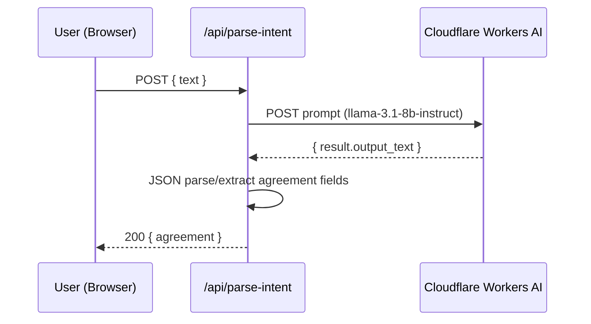
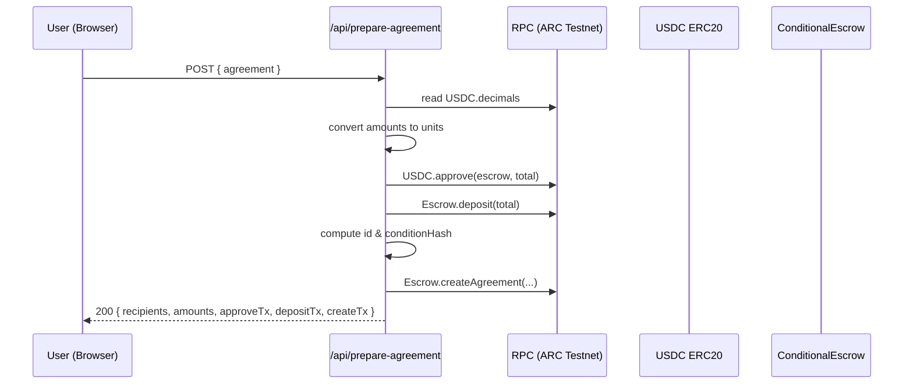
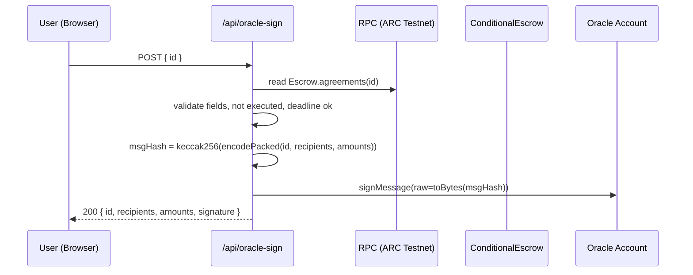

# PayStream — Arc AI Agent for USDC Streams

A full-stack demo that turns natural language into on-chain USDC payment agreements on Arc testnet. The app parses user intent (Cloudflare Workers AI), prepares and registers agreements on-chain (USDC approve, deposit, create), obtains an oracle signature, and executes the agreement to distribute funds.

- Frontend: Next.js 15 (`paystream`), Tailwind, React 19, thirdweb client
- API: Next.js API routes (`paystream/pages/api/*`) using `viem`
- Contracts: `src/ConditionalEscrow.sol` with tests and a mock USDC
- Aux tooling: Node scripts under `server/*`, a Cloudflare worker in `worker/*`, and a simple agent in `agent/*`

## Contents
- Overview
- Repository Structure
- Features
- Architecture
- Environment Variables
- Getting Started
- API Reference
- Smart Contract
- Deployment & Ops
- Troubleshooting
- Security Notes

## Overview
PayStream showcases a natural-language to on-chain agreement flow:
1. Parse intent: Convert user text to structured recipients/amounts/conditions.
2. Prepare agreement: Approve USDC, deposit into escrow, and create the agreement.
3. Oracle sign: Off-chain oracle signs the canonical `(id, recipients, amounts)` message.
4. Execute: Submit the oracle signature on-chain to distribute funds.

## Repository Structure

```
.
├─ paystream/                  # Next.js app (UI + API)
│  ├─ src/app/                # App router UI, layout, styles
│  ├─ pages/api/              # API routes (parse-intent, prepare, oracle-sign, execute)
│  ├─ next.config.mjs         # Lightweight Next config (reduced runtime overhead)
│  ├─ tsconfig.json           # TypeScript config
│  └─ README.md               # App-level starter README (thirdweb template)
├─ server/                     # Node scripts for Circle, deployment helpers
├─ worker/                     # Cloudflare worker (wrangler)
├─ agent/                      # Simple agent utilities (wallet generation, etc.)
├─ src/                        # Solidity contracts and tests
│  ├─ ConditionalEscrow.sol   # Main escrow contract
│  ├─ mocks/MockUSDC.sol      # Mock token for testing
│  └─ test/ConditionalEscrow.t.sol
├─ .env                        # Local environment (ignored)
├─ .gitignore                  # Global ignores (includes .env, build artifacts)
└─ package-lock.json           # Root lockfile (npm)
```

Note: `paystream` currently appears as a git submodule-like entry on GitHub. If you prefer tracking its files directly in this repo (normal folder), we can convert it; just ask.

## Features
- Natural-language agreement extraction powered by Cloudflare Workers AI.
- Agreement lifecycle with USDC escrow: approve, deposit, create, sign, execute.
- Oracle-controlled execution using an off-chain signature.
- Thirdweb client setup for future on-chain interactions from the UI.
- Lightweight Next configuration to reduce CPU/RAM usage.

## Architecture

High-level components and data flow:

```mermaid
flowchart LR
  subgraph Browser
    UI[Next.js UI\nsrc/app/*]
  end

  subgraph NextJS[Next.js App (paystream)]
    API1[/api/parse-intent/]
    API2[/api/prepare-agreement/]
    API3[/api/oracle-sign/]
    API4[/api/execute-agreement/]
  end

  subgraph Chain[ARC Testnet]
    USDC[(USDC ERC20)]
    Escrow[(ConditionalEscrow)]
  end

  subgraph Offchain[Off-chain Services]
    CF_AI[Cloudflare Workers AI]
    OracleKey[(ORACLE_PRIVATE_KEY)]
  end

  UI --> API1
  UI --> API2
  UI --> API3
  UI --> API4

  API1 --> CF_AI
  API2 --> USDC
  API2 --> Escrow
  API3 --> Escrow
  API3 --> OracleKey
  API4 --> Escrow
  API4 --> OracleKey
```

Key flows:

- Parse Intent


- Prepare Agreement


- Oracle Sign


- Execute Agreement
```mermaid
sequenceDiagram
  participant U as User (Browser)
  participant API as /api/execute-agreement
  participant RPC as RPC (ARC Testnet)
  participant ESC as ConditionalEscrow
  participant ORA as Oracle Account

  U->>API: POST { id, recipients[], amounts[] }
  API->>API: check oracle address; setOracle if owner & mismatched
  API->>API: msgHash & signature
  API->>RPC: Escrow.executeAgreement(id, signature)
  API-->>U: 200 { executeTx, signature, recipients, amounts }
```

## Environment Variables
Create `.env` at the repository root (kept private by `.gitignore`).

- Cloudflare Workers AI
  - `WORKERS_AI_KEY` — API token
  - `WORKERS_AI_ACCOUNT_ID` — your CF account ID

- Chain (Arc Testnet)
  - `RPC_URL` — Arc RPC endpoint URL
  - `CHAIN_ID` — numeric chain ID
  - `USDC_ADDRESS` — ERC20 token address
  - `CONTRACT_ADDRESS` — deployed `ConditionalEscrow` address
  - `PRIVATE_KEY` — `0x`-prefixed deployer/user private key
  - `ORACLE_PRIVATE_KEY` — `0x`-prefixed oracle private key

- Frontend
  - `NEXT_PUBLIC_TEMPLATE_CLIENT_ID` — thirdweb client ID for `src/app/client.ts`

Ensure these are available to the Next.js app (dev reads from `.env.local`; production build reads from `.env` as configured by Next).

## Getting Started

Prerequisites
- `node` 20+
- `npm` (or `pnpm`, but use one consistently)

Install & Run (Dev)
- `cd paystream`
- `npm install`
- `npm run dev -- --port 3000 --hostname 127.0.0.1`
- Open `http://127.0.0.1:3000/`

Production
- `npm run build`
- `npx next start -p 3000 --hostname 127.0.0.1`

Lockfiles
- You may see a warning about multiple lockfiles: root `package-lock.json` and `paystream/pnpm-lock.yaml`.
- For consistency, remove `paystream/pnpm-lock.yaml` if you’re using npm.

## API Reference

Base URL: `http://127.0.0.1:3000`

1) `POST /api/parse-intent`
- Body: `{ "text": "send 1 USDC to 0xabc and 0xdef by tomorrow" }`
- Returns: `{ agreement: { recipients[], amounts[], deadline_hours, condition, notes } }`
- Env: `WORKERS_AI_KEY`, `WORKERS_AI_ACCOUNT_ID`

Example:
```
curl -X POST http://127.0.0.1:3000/api/parse-intent \
  -H "Content-Type: application/json" \
  -d '{"text":"send 1 USDC to 0xabc and 0xdef by tomorrow"}'
```

2) `POST /api/prepare-agreement`
- Body: `{ agreement: { recipients: ["0x..."], amounts: ["1.00"], deadline_hours, condition } }`
- Actions: reads USDC decimals, approves, deposits, creates agreement
- Returns: `{ recipients, amounts, approveTx, depositTx, createTx, chainId }`
- Env: `RPC_URL`, `CHAIN_ID`, `USDC_ADDRESS`, `CONTRACT_ADDRESS`, `PRIVATE_KEY`

3) `POST /api/oracle-sign`
- Body: `{ id: "0x...bytes32" }`
- Actions: reads agreement; signs `(id, recipients, amounts)`
- Returns: `{ id, recipients, amounts, signature }`
- Env: `RPC_URL`, `CHAIN_ID`, `CONTRACT_ADDRESS`, `ORACLE_PRIVATE_KEY`

4) `POST /api/execute-agreement`
- Body: `{ id, recipients: ["0x..."], amounts: ["1000000", ...] }` (amounts in base units)
- Actions: sanity-check oracle; sign and call `executeAgreement`
- Returns: `{ ok, id, executeTx, signature, recipients, amounts, msgHash, ethHash }`
- Env: `RPC_URL`, `CHAIN_ID`, `CONTRACT_ADDRESS`, `PRIVATE_KEY`, `ORACLE_PRIVATE_KEY`

## Smart Contract

`src/ConditionalEscrow.sol`
- `deposit(uint256 amount)`: receives USDC into escrow.
- `createAgreement(bytes32 id, address[] recipients, uint256[] amounts, uint256 deadline, bytes32 conditionHash)`: registers an agreement.
- `oracle`: designated address for execution authorization.
- `executeAgreement(bytes32 id, bytes signature)`: verifies oracle signature and distributes USDC.

Data Model (agreement)
- `creator`: address
- `recipients`: `address[]`
- `amounts`: `uint256[]`
- `totalAmount`: `uint256`
- `deadline`: `uint256` (epoch seconds)
- `conditionHash`: `bytes32`
- `executed`: `bool`

Signature
- `msgHash = keccak256(encodePacked(id, recipients, amounts))`
- Oracle signs raw bytes of `msgHash` (not EIP-712) for simplicity.

## Deployment & Ops

Next.js
- Dev: `npm run dev -- --port 3000 --hostname 127.0.0.1`
- Production: `npm run build` then `npx next start -p 3000 --hostname 127.0.0.1`

Cloudflare Worker (worker/)
- Configure `wrangler.toml` and secrets
- Deploy with `wrangler publish`

Contracts
- Deploy `ConditionalEscrow.sol` with your preferred toolchain
- Set `CONTRACT_ADDRESS` in `.env`
- Fund the deployer and escrow with necessary USDC for tests

Circle scripts (server/)
- Helpers to interact with Circle APIs and dev flows
- Provide API keys and environment in local `.env` or script-level config

## Troubleshooting

Connection refused on `localhost`
- Bind to `127.0.0.1` (`--hostname 127.0.0.1`)
- Check port in use: `netstat -ano | findstr :3000`

High CPU/RAM in dev
- Use production start for demos
- We set `images.unoptimized` and disabled production source maps in `next.config.mjs`

Missing package: `pino-pretty`
- If you see a build error, either install it (`npm i pino-pretty`) or remove from `serverExternalPackages` if unused

Env var issues
- Verify required vars for each API route (see API Reference)
- Do not commit `.env`; it’s ignored by `.gitignore`

Node version
- Ensure Node 20+ for Next.js 15 and React 19

## Security Notes
- Secrets are not committed (`.env` is ignored)
- Keep private keys safe; never hardcode secrets in source files
- Restrict oracle privileges to a dedicated key

---

For questions or improvements, open an issue or reach out. If you want the `paystream` directory tracked as normal files (not a submodule-like entry), I can convert it in a follow-up.